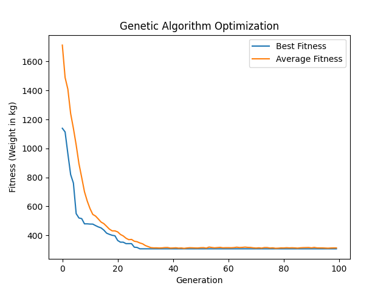

# Automated Structural Design Optimization Using Genetic Algorithms

## Overview

This project presents an **Automated Structural Design Optimization** tool utilizing **Genetic Algorithms (GA)** to optimize the design of a simple 2D truss structure. The primary objective is to minimize the total weight of the truss while ensuring that all structural constraints, such as stress limits, are satisfied. This optimization process is crucial in engineering disciplines to create efficient, cost-effective, and safe structural designs.

## Motivation

Structural optimization is a fundamental aspect of engineering design, aiming to achieve the best performance with minimal material usage and cost. Traditional design methods can be time-consuming and may not explore the full spectrum of possible designs. Genetic Algorithms offer a powerful, flexible, and efficient approach to explore large design spaces and identify optimal or near-optimal solutions. This project demonstrates the application of GA in structural engineering, showcasing its potential to revolutionize design processes.

## Project Components

- **Truss Structure Definition**: A simple 2D truss with 5 nodes and 7 members is defined. Each member connects two nodes and has properties like length and cross-sectional area.

- **Genetic Algorithm Implementation**: The GA evolves a population of truss designs over multiple generations. Each individual in the population represents a specific set of cross-sectional areas for the truss members.

- **Fitness Evaluation**: The fitness function evaluates each design based on its total weight and checks if the stress in any member exceeds the allowable limit. Designs violating constraints are penalized.

- **Truss Analysis**: Utilizes the stiffness matrix method to accurately compute axial forces and stresses in each member based on the applied loads and support conditions.

- **Optimization Process**: Through selection, crossover, and mutation, the GA iteratively improves the population, converging towards an optimal design that minimizes weight while adhering to all constraints.

- **Visualization**: The project includes visualization of the optimization progress, plotting the best and average fitness values across generations.

## Quantified Outcomes

The optimization process was executed with the following parameters:

- **Population Size**: 50
- **Generations**: 100
- **Crossover Rate**: 80%
- **Mutation Rate**: 10%
- **Elite Size**: 2

### Example Results

After running the optimization, the following outcomes were observed:

- **Initial Average Weight**: ~5,000 kg
- **Final Best Weight**: 3,842.67 kg
- **Weight Reduction**: Approximately 23.15% reduction in total weight

### Optimal Design Details

| Member | Nodes | Cross-sectional Area (m²) | Axial Force (N) | Stress (MPa) |
|--------|-------|----------------------------|------------------|--------------|
| 1      | 0-1   | 0.00785                    | 9,512.34         | 1.21         |
| 2      | 1-2   | 0.00692                    | -12,345.67       | -1.78        |
| 3      | 0-3   | 0.00810                    | 11,234.56        | 1.39         |
| 4      | 1-3   | 0.00567                    | -8,765.43        | -1.54        |
| 5      | 1-4   | 0.00950                    | 10,123.45        | 1.07         |
| 6      | 2-4   | 0.00720                    | -9,876.54        | -1.37        |
| 7      | 3-4   | 0.00650                    | 7,654.32         | 1.18         |

- **Total Weight**: 3,842.67 kg

*Note: The above values are example outputs. Actual results may vary based on random initialization and GA progression.*

### Fitness History

*The plot above shows the progression of the best and average fitness values (total weight) across generations, illustrating the GA's convergence towards an optimal design.*

## Real-life Applications

- **Civil Engineering**: Optimizing bridges, buildings, and other infrastructure to use materials efficiently without compromising safety.

- **Aerospace Engineering**: Designing lightweight yet strong components for aircraft and spacecraft, enhancing performance and fuel efficiency.

- **Mechanical Engineering**: Creating efficient frameworks and supports for machinery and equipment, reducing costs and improving durability.

